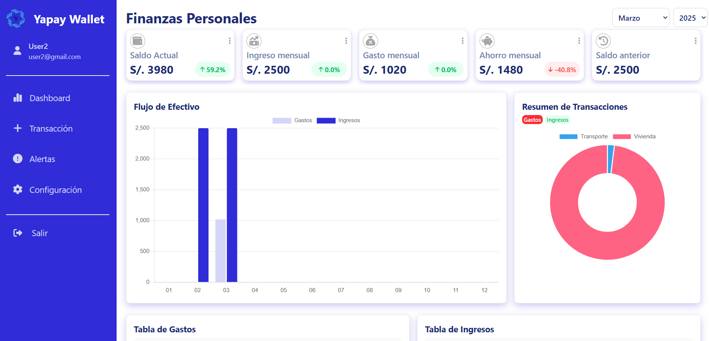
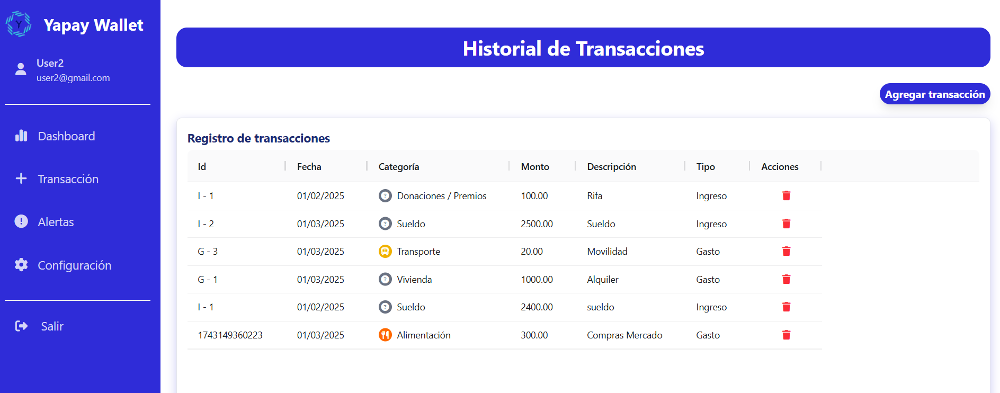

# Dashboard de Finanzas Personales

Este es un **Dashboard de Finanzas Personales** que permite a los usuarios gestionar su presupuesto, seguir sus gastos e ingresos, y visualizar gráficos interactivos utilizando **AG Grid** y **Chart.js**. Los usuarios pueden iniciar sesión para guardar sus registros de transacciones en el **localStorage**.

## Tecnologías utilizadas

- **HTML5**: Estructura de la página web.
- **CSS3**: Estilos y diseño responsivo.
- **Tailwind CSS**: Utilizado para estilizar de manera eficiente y modular.
- **JavaScript**: Lógica de la aplicación, gestión de datos y funcionalidad.
- **AG Grid**: Utilizado para mostrar y organizar las transacciones de manera eficiente.
- **Chart.js**: Librería para generar gráficos interactivos y visualizaciones de datos.
- **Webpack 4**: Herramienta de empaquetado para manejar y optimizar el código.

## Instalación

1. Clona el repositorio:

   ```bash
   git clone https://github.com/DennisMiranda/personal-finance-dashboard.git
   ```

2. Navega al directorio del proyecto:

   ```bash
   cd personal-finance-dashboard
   ```

3. Instala las dependencias:

   ```bash
   npm install
   ```

4. Inicia el servidor de desarrollo:
   ```bash
   npm run start
   ```

## Uso

1. **Página de inicio de sesión**: Los usuarios deben iniciar sesión para acceder al dashboard.
2. **Gestión de transacciones**: Los usuarios pueden agregar y eliminar transacciones de ingresos y gastos.
3. **LocalStorage**: Los registros de transacciones se guardan en el **localStorage** para su persistencia entre sesiones.
4. **Visualización**: Los gráficos y tablas se actualizan automáticamente para mostrar los datos más recientes.

## Imágenes del Proyecto

### Visualización del Dashboard:



### Visualización de Transacciones:


